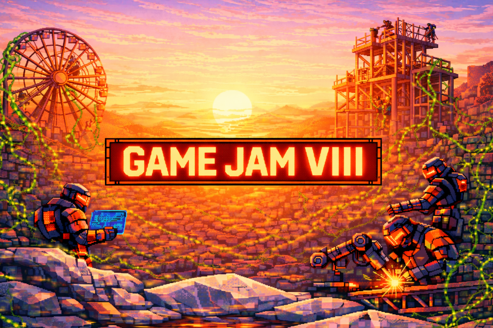

# Dojo Game Jams



​Dojo **Game Jam VIII** is here and **starts on 2/27**!

​Teams will come together for **3 days** to build games on the open-source, provable Dojo Engine, competing for a slice of a **$10,000 prize pool**.

## Getting Started

### Existing Team

👉 [**Register your game idea here**](https://github.com/dojoengine/game-jams/issues/new?assignees=&labels=&projects=&template=register_project.yaml&title=%5BProject+Registration%5D:+Your+Project+Name)


If you have any questions or need support, head over to the **#game-jam** channel in the [Dojo Discord](https://discord.gg/tHezCAA4).

### No Team

👉 [**Register your game idea here**](https://github.com/dojoengine/game-jams/issues/new?assignees=&labels=&projects=&template=register_project.yaml&title=%5BProject+Registration%5D:+Your+Project+Name)

Then head over to the **#game-jam** channel in the [Dojo Discord](https://discord.gg/tHezCAA4) and start recruiting.
The Dojo team will do our best to help match you with great people.

If you're looking for game ideas, Dojo maintains a [**spreadsheet of interesting game concepts**](https://docs.google.com/spreadsheets/d/16onyBjTdgYFO1W7bGfSXldpdjLvv9SPk5p3k88eJWBs).
Feel free to grab an idea off the list!

## Tutorials

If you're new to Dojo development, the [Dojo Book](https://book.dojoengine.org/) is a great place to start your Dojo development journey.

To learn more about Dojo's new Sensei MCP server and to get started, check out the documentation [here](https://github.com/dojoengine/sensei-mcp/blob/main/README.md).
See [here](https://github.com/dojoengine/vibe-sample) for an example game vibe-coded with the help of Sensei.

As always, if you have any questions or need any support, head over to the **#game-jam** channel in the [Dojo Discord](https://discord.gg/tHezCAA4).

## Claude Code Skills

If you're using [Claude Code](https://claude.ai/code), you can install **skills** that give Claude specialized knowledge about Dojo and Cartridge.
Skills are like plugins that teach Claude how to work with specific frameworks.

Once installed, you can ask Claude things like:
- "Create a Dojo model for a player inventory"
- "Set up a Cartridge Controller connection"
- "Write tests for my Dojo system"

Install the skills:

```bash
# Dojo skills (models, systems, testing, deployment)
npx skills add dojoengine/book

# Cartridge Controller skills
npx skills add cartridge-gg/docs
```

After installing, restart Claude Code to activate the skills.

## Rules

-   Submissions must be built using the Dojo Engine.
-   ​Submissions must be deployed to Slot / Sepolia.
-   ​Submissions must use the [Cartridge Controller](https://docs.cartridge.gg/controller/getting-started).
-   Submissions must be built during the game jam 72-hour window and exclusively for the Dojo Game Jam.
    -   New features for existing games are allowed, but must be clearly scoped and defined.
-   Extensibility and composability are core to fully onchain games, but all sources must be cited. This includes but is not limited to:
    -   Worlds being extended
    -   Code, Plugins, Libraries, and Visual Assets
-   Winning projects are determined subjectively by our panel of judges based on the listed criteria.
-   Dojo is an inclusive ecosystem. All forms of discrimination are strictly prohibited.
-   Projects can be removed from the Game Jam by the judges for any reason.
-   5 contributors is the maximum team size.

> Note: Vibe-coding is encouraged but **not strictly required**.
> If you want to be old-school and write everything by hand, go for it!

## Submitting

Coding begins Friday, February 27 at 00:00 **AOE**, and submissions are due on Sunday, March 2 at 23:59 **AOE**.
We use **AOE** (anywhere on earth) to make it easy to participate from anywhere on the planet.

> If you submit late, we will ignore any commits made after the deadline.

Submit your project before the deadline to qualify for the prizes:

-   Copy / Paste the [Game Jam Submission Template](./templates/SUBMISSION_TEMPLATE.md), follow the instructions, and open a Pull Request which contributes the submission to the repository.
-   Create a new file in the [`game-jam-8` directory](./game-jam-8) using the name of your project in `kebab-case` as the file name.
-   See [EXAMPLE_SUBMISSION.md](./templates/EXAMPLE_SUBMISSION.md) for what a complete submission looks like.

### Submission Checklist

Before submitting, make sure you have:

- [ ] **Dojo contracts** with models and systems (not just config files)
- [ ] **Frontend that uses Dojo SDK** (contracts must be integrated, not just present)
- [ ] **Deployed to Slot / Sepolia**
- [ ] **Cartridge Controller** for wallet connection
- [ ] **Play instructions** with live URL, video demo, or setup steps

## What We Check

When you submit a PR, an automated screening process checks your submission.
Here's what we verify:

1. **Dojo Usage**: Your project must meaningfully use the Dojo engine—Cairo contracts with `#[dojo::model]`, `#[dojo::contract]`, etc., and a frontend that actually integrates with them.
2. **Timeline**: The bulk of your work should happen during the 72-hour jam window. Post-deadline polish and deployment commits are fine.

Our philosophy is **pragmatic and inclusive**—we default to approving submissions and give benefit of the doubt.
See [SCREENING.md](./SCREENING.md) for full details.

## Judging

Review and judging of projects will take place in the week after the game jam concludes. Judging is subjective, but it will be based on the criteria listed below.

1.  Novel use of the unique properties of the Dojo Engine.
2.  Originality of concept, game mechanics, visual design, etc.
3.  Compelling visual and game design.
4.  Level of fun!
