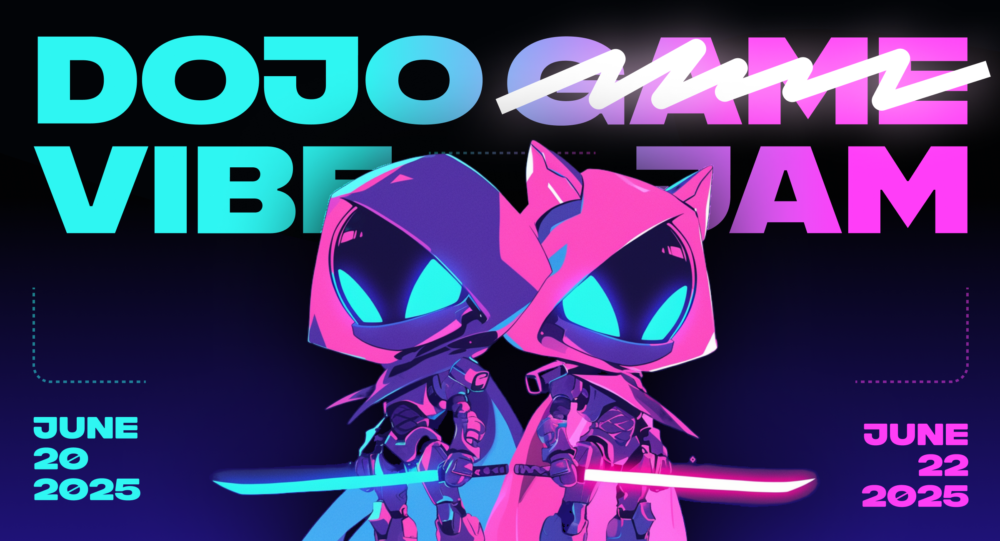

# Dojo Game Jams

​Dojo G̶a̶m̶e̶ Vibe Jam is here and starts on 6/20!!

​Join us for a special vibe-coding edition of the Dojo Game Jam! Teams will come together for 3 days to build games on the open-source, provable Dojo Engine, and compete for a slice of a $25,000 prize pool.

## Tracks

This Game Jam will have two tracks: full games, and game mods.

1. The **Full Game Track** is for large or existing teams who want to ship full games or major features.
2. The **Modding Track** is for small teams and solo devs who want to get their feet wet by modding existing games.

## Prizes

We have a $25,000 prize pool to award to projects. $15,000 will go to projects in the **full game** track, and $10,000 will go to projects in the **modding** track.

> Please note: there will be **no airdrops** for participation in the Game Jam.
> Prizes will only be awarded to teams that build excellent projects that demonstrate the unique capabilities of the Dojo engine.

## Getting Started

### Full game track, existing team

If you're planning on submitting for the **full game** track and you **already have a team**, then get at it!
If you have any questions or need any support, head over to the **#game-jam** channel in the [Dojo Discord](https://discord.gg/tHezCAA4).

### Full game track, no team

If you want to create a full game but you don't already have a team, you can [**register your game idea here**](https://github.com/dojoengine/game-jams/issues/new?assignees=&labels=&projects=&template=register_team.yaml&title=%5BTeam+Registration%5D:+Your+Team+Name).
Then head over to the **#game-jam** channel in the [Dojo Discord](https://discord.gg/tHezCAA4) and start recruiting.
The Dojo team will do our best to help match you with great people.

### Modding track

If you're a solo developer / small team and want to make a mod for an existing game, check out our [modding guide](./MODDABLE.md) for a list of recommended games for modding.
If you have any questions or need any support, head over to the **#game-jam** channel in the [Dojo Discord](https://discord.gg/tHezCAA4).

## Tutorials

If you're new to Dojo development, the [Dojo Book](https://book.dojoengine.org/) is a great place to start your Dojo development journey.

To learn more about Dojo's new Sensei MCP server and to get started, check out the documentation [here](https://github.com/dojoengine/sensei-mcp/blob/main/README.md).
See [here](https://github.com/dojoengine/vibe-sample) for an example game vibe-coded with the help of Sensei.

As always, if you have any questions or need any support, head over to the **#game-jam** channel in the [Dojo Discord](https://discord.gg/tHezCAA4).

## Rules

-   Submissions must be built using the Dojo Engine.
-   ​Submissions must be deployed to Slot / Sepolia.
-   ​Submissions must use the [Cartridge Controller](https://docs.cartridge.gg/controller/getting-started).
-   Submissions must be built during the game jam 72-hour window and exclusively for the Dojo Game Jam.
    -   New features for existing games are allowed, but must be clearly scoped and defined.
-   Extensibility and composability are core to fully onchain games, but all sources must be cited. This includes but is not limited to:
    -   Worlds being extended
    -   Code, Plugins, Libraries, and Visual Assets
-   Winning projects are determined subjectively by our panel of judges based on the listed criteria.
-   Dojo is an inclusive ecosystem. All forms of discrimination are strictly prohibited.
-   Projects can be removed from the Game Jam by the judges for any reason.
-   5 contributors is the maximum team size.

## Submitting

​Submissions are due on Monday, June 23 at 7:59 AM UTC which is Sunday, June 22 at 23:59 PST

Submit your project before the Game Jam deadline to qualify for the prizes.

-   Copy / Paste the [Game Jam Submission Template](./templates/SUBMISSION_TEMPLATE.md), follow the instructions, and open a Pull Request which contributes the submission to the repository.
-   Create a new file [`game-jam-6` directory](./game-jam-6) using the name of your project in `kebab-case` as the file name.

## Judging

Review and judging of projects will take place in the week after the game jam concludes. Judging is subjective, but it will be based on the criteria listed below.

1.  Novel use of the unique properties of the Dojo Engine.
2.  Originality of concept, game mechanics, visual design, etc.
3.  Compelling visual and game design.
4.  Level of fun!
