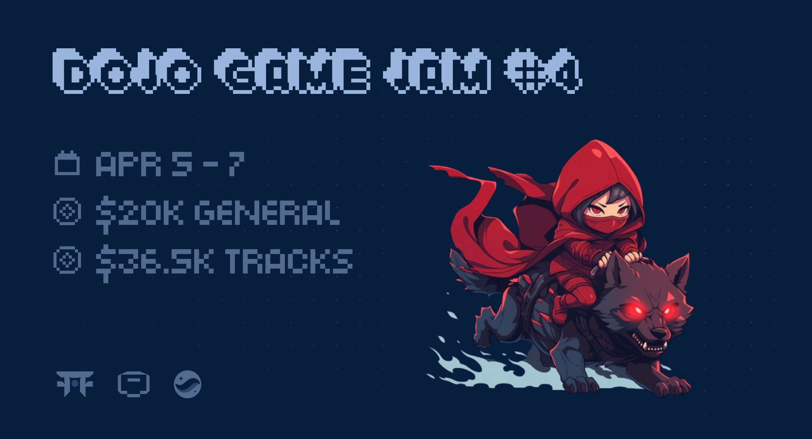
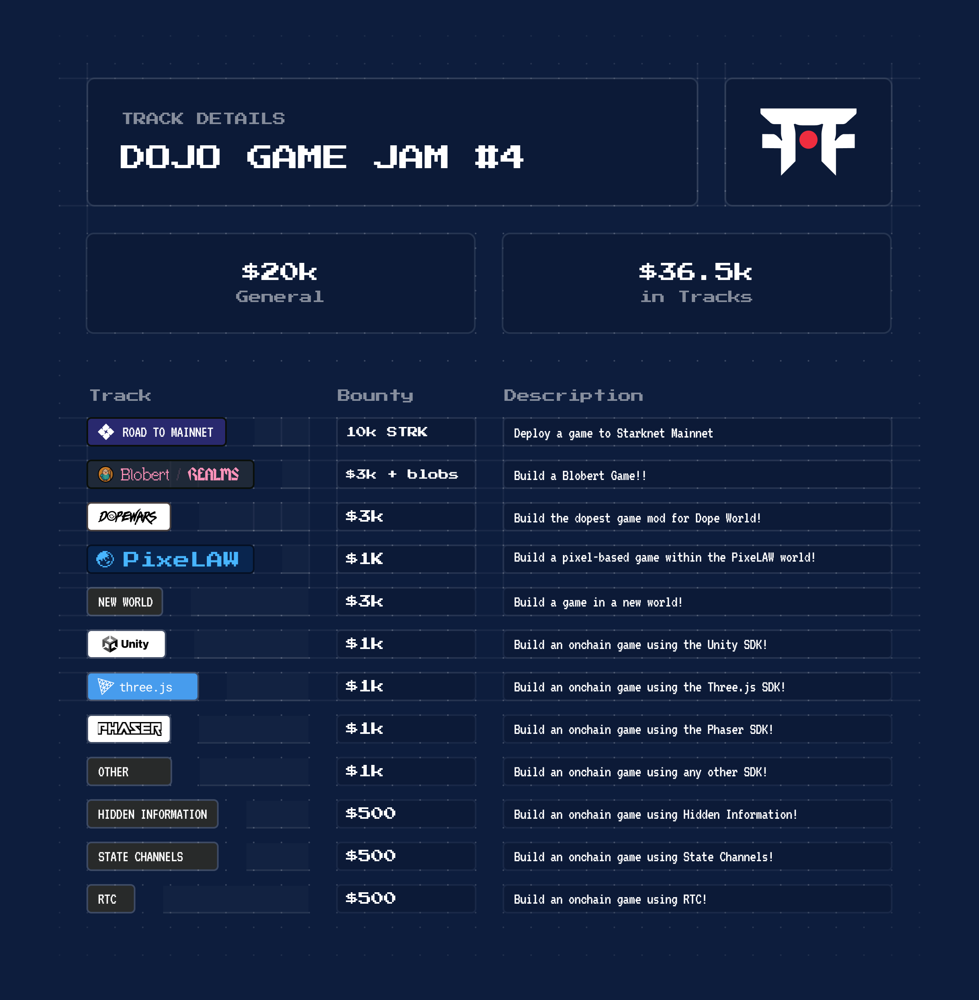

The Dojo Game Jam is back! This 72-hour weekend will bring together the Dojo ecosystem to build games on the open-source, provable Dojo Engine.

Prizes will be awarded to winning teams, but the goal of this game jam is to combine the efforts of those who share the vision of fully onchain games and to identify teams who are ready to build and ship!

If you’re ready to get involved and find a team, introduce yourself in the Dojo Discord - new contributors are always welcome. From there, the Dojo Book is a great place to start your journey.

  

## Prizes

$20K General + $36.5K Bounty Tracks!

Please note: there will be no airdrops for participation in the Game Jam. Prizes will only be awarded to teams that build excellent projects that demonstrate the unique capabilities of the Dojo engine.

## Rules

- Submissions must be built using the Dojo Engine.
- Submissions must be built during the game jam 72-hour window and exclusively for the Dojo Game Jam.
- Extensibility and composability are core to fully onchain games, but all sources must be cited. This includes but is not limited to:
  - Worlds being extended
  - Code, Plugins, Libraries, and Visual Assets
- Winning projects are determined subjectively by our panel of judges based on the listed criteria.
- Dojo is an inclusive ecosystem. All forms of discrimination are strictly prohibited.
- Projects can be removed from the Game Jam by the judges for any reason.
- 5 contributors is the maximum team size.

## Submitting

Submit your project before the Game Jam deadline to qualify for the prizes.

- Copy / Paste the <a href="https://raw.githubusercontent.com/dojoengine/game-jams/main/submissions/TEMPLATE.md" target="_blank">Game Jam Submission Template</a>, follow the instructions, and open a Pull Request which contributes the submission to the repository.
- <a href="https://github.com/dojoengine/game-jams/new/main/submissions" target="_blank">Create a new file</a> in the `submissions` directory using the name of your project in `shotgun-case` as the file name.

## Judging

Review and judging of projects will take place in the week after the game jam concludes. Judging is subjective, but it will be based on the criteria listed below.

1. Novel use of the unique properties of the Dojo Engine
2. Originality of concept, game mechanics, visual design, etc.
3. Compelling visual and game design
4. Level of fun
