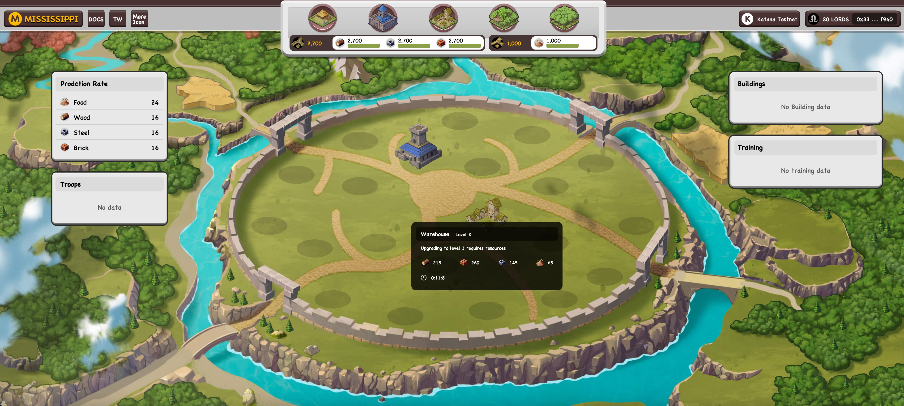

# Kingdom of Lords

### Project Summary

We rolled out the very initial version including the upgrading/resource-producing features. Try now: https://kingdom.0xmssp.xyz

Gameplay:

Simulation: Upgrade buildings/farms to enhance resource productivity and train troops

Strategy: Form alliances to battle with others and construct The Wonders to win

Low-frequency interaction while requiring huge strategic thinking, well adapted to blockchains

Integration with Realms Ecosystem:

Deposit Lords to get in-game tokens to enhance productivity and construction speed, adding up to the possibility of winning the game(This feature is still under development)
Technical Highlights:

Privacy System: When deploying troops, users can choose to hide their coordinates and verify them later when selecting their next action, such as attacking. This enables an ambush feature, allowing users to lie in wait at a specific geographical location and attack the enemy unexpectedly, significantly enhancing the game's strategic depth(This feature is still under development)

### GitHub
The frontend repo:[Frontend](https://github.com/Mississippi-Labs/kingdom_and_lord_fe)
The Cario contract address: [Dojo Contract](https://github.com/Mississippi-Labs/kingdom_and_lord)

### Play
The playtest page:[Play](https://kingdom.0xmssp.xyz/)

### Twitter
Feel free to follow us on our social accounts
[Twitter](https://twitter.com/0xMississippi)

### Team members
Fe:[Tiyo](https://github.com/TiyoSheng)
Tech:[lidamao](https://github.com/LidamaoHub)
Contract:[will](https://github.com/zsluedem)

### Submission Tracks
> - General track
> - Road to Mainnet 
> - Hidden Information
> - New World

